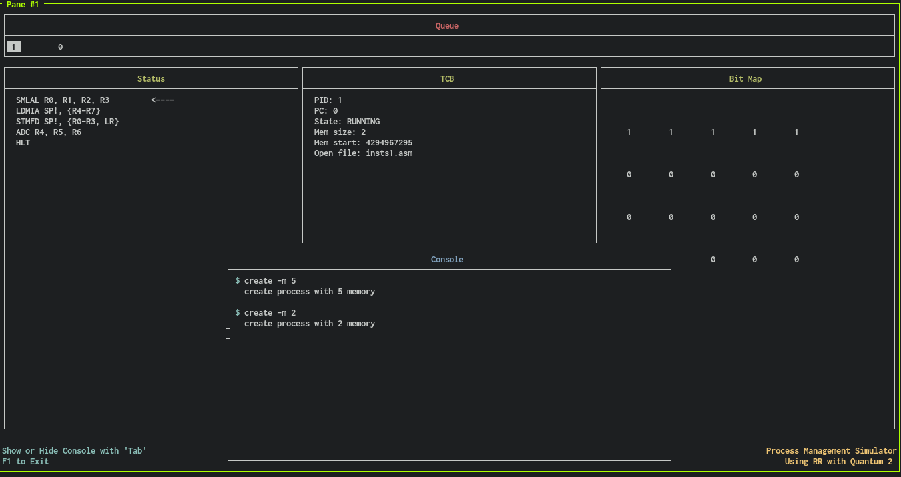

# Oh!C

**Oh!**perating 

**C**ystems

**C**mulator

Oh!C is an operating systems simulator that allows a user to:

- Select scheduler mode: choose between a FIFO mode or Round Robin
- Select size of memory to load in bit map

# Usage
## For Round Robin mode
`./main -q <quantum_size>`

## For FIFO mode
`./main`

## Example of running program

 
